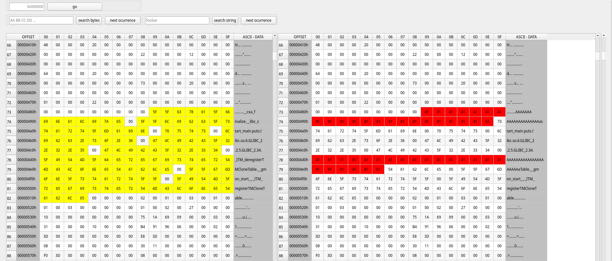

# IronHex: a simple hex editor in Qt

----

## Features

1. Load file and hex edit content
2. Highlight ascii strings
3. Load 2nd file and bindiff

----

## todo

1. Implement search hexbytes and strings
2. Build the project statically

